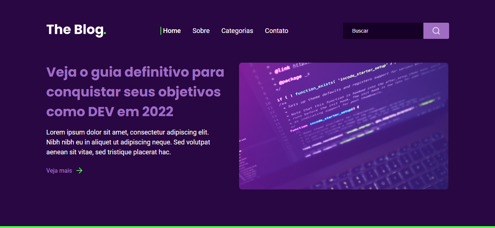

<h1 align="center">
  RocketBlog
</h1>

  

 

Landing page feita para um desafio do programa Discover da RocketSeat. (APENAS PARA DESKTOP)

## 🛠️ Tecnologias

Esse projeto foi desenvolvido utilizando as tecnologias:

- HTML
- CSS

## 🖼️ Projeto

Preview: https://edusmpaio.github.io/rocketblog/

## 🎨 Layout 

Figma: https://www.figma.com/file/r4CsL6MPTAvE7EvJXjhFK4/DD-RocketBlog/duplicate
